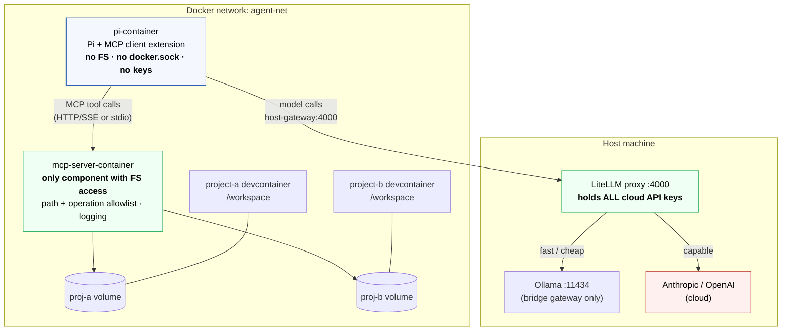
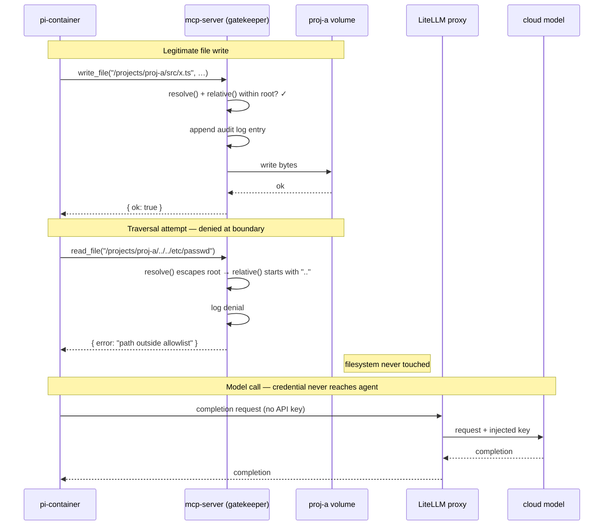
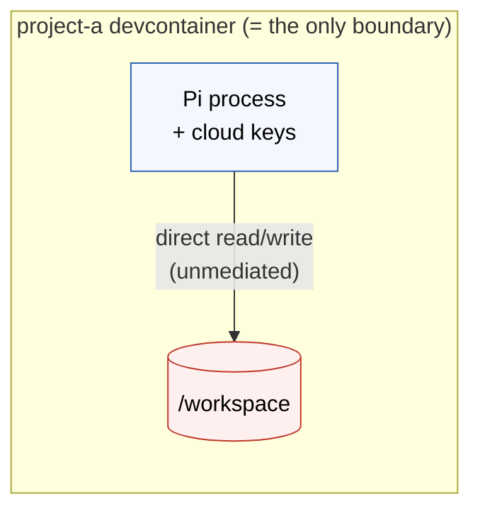
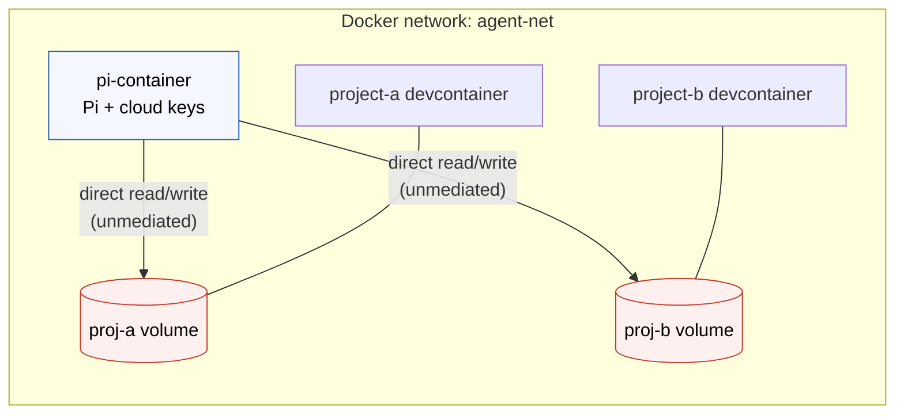
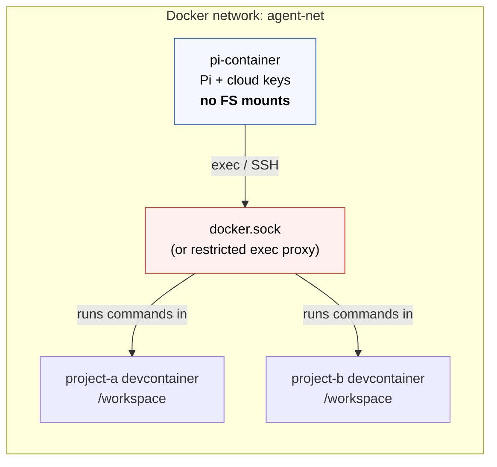

# Local agent architecture

## The problem

Pi is a minimal coding agent harness – really, it's more of a baseline framework on which you program your own custom harness, rather than a finished product.

Out-of-the-box, Pi runs with full system permissions with zero security controls. This is a deliberate design choice, not a bug. But running such an agent directly on your host machine carries non-trivial risks, since doing so exposes:

- Your host dotfiles – `~/.ssh/*`, `~/.config/*`, `~/.gitconfig` – and the security credentials they contain.
- Cloud API keys held in the host environment.
- Everything on disk – not only your programming projects.
- The host network and process space.

The risk is not hypothetical. The agent executes model-directed tool calls – file reads/writes, shell commands, etc. – and third-party extensions, any of which can be influenced by prompt injection or contain malicious code. Furthermore, due to the non-determinism of the underlying large-language models, compromises can surface without a software update. All AI agents, run locally, carry these risks – they're inherent in how LLMs work and so can't be fully negated through guardrails taught to the model.

A combination of containerization plus Pi extensions can be used to strengthen the security profile. But, with Pi, it's up the operator to decide what this is and how it is achieved.

This document records my own choices in the design of a secure local agent architecture. My requirements were:

* A security profile suitable for using agents in regulated industries – I work in these.
* Easy and reliable portability between development environments – as an IT contractor, I move around a lot.

## The solution

I explored a number of possible architectures to _securely_ run agents locally, and models either locally or in-the-cloud.

The preferred solution involves running the Pi coding agent in its own dedicated, hardened container, which has no direct filesystem access, no Docker socket, and not even the cloud credentials needed to access remote models.
continue
Access to project files is mediated by a separate containerized MCP server. This is responsible for enforcing path and operation allowlists, and it logs every call – useful in the context of regulated industries.

All model traffic is routed through a host-side proxy that holds the API keys.

This is the strongest of the four isolation models considered (described below). It is my preferred choice since it has the strongest security profile – specifically, it prevents a compromised agent or a misbehaving model from reaching host files, cloud credentials, or sibling projects.

The solution also aligns with emerging best practices in 2025-2026. MCP (Model Context Protocol) has become the standard way to _control_ an agent's access to tools, including filesystem access. Instead of the agent having direct filesystem access, it calls MCP servers that expose specific, scoped operations. The MCP server is the gatekeeper.

But running MCP servers natively on your host machine still gives access to your filesystem, environment variables, and network. But in combination with Docker, MCP servers can be run in isolated environments with controlled access to files, networks, and secrets.

This architecture means the agent itself never touches the host filesystem directly. It issues MCP tool calls, and the containerized MCP servers enforce what's actually accessible.

Tooling is already mature in this solution space. **Docker MCP Toolkit** is a free feature in Docker Desktop that runs MCP servers in containers and handles the plumbing to your agent client – whether that be Pi, LM Studio, Claude Desktop, etc. Docker MCP Toolkit can be configured with environment environments, API keys, and other secrets required by the agent – so the agent doesn't need to hold these things itself. And it provides security checks for both tool calls and the resulting outputs.

<!-- TODO: Alternative - custom TypeScript MCP server with
path/operation allowlists + structured logging. Gives reviewable,
version-controlled policy. -->

Another piece of the jigsaw is to have some sort of proxy between the agent and the model servers. The objective here is to automatically route requests to different models, eg. local or cloud. This is an emerging pattern, and **LiteLLM** is emerging as the _de facto_ standard. It is a lightweight proxy, aka. model router, between the agent and the models. It presents a unified OpenAI-compatible API and routes to local or cloud models based on rules you define. You can even configure it with per-model token budgets and rate limits. LiteLLM runs on your host (alongside Ollama).

```
agent
  └── model router - eg. LiteLLM, Ollama proxy
        ├── local: ollama - low latency, no data leaves machine
        └── cloud: Anthropic API - for frontier model access
```

## Motivation

**The objective is security first.** The most important constraint is **filesystem isolation**.

We want a configuration where a fully compromised Pi process has neither project files outside its scope, nor host files, nor cloud credentials, nor host Docker control — and where every action it takes against the filesystem is observable and auditable. Convenience, multi-project support, and environment fidelity are secondary and are traded off explicitly in favour of isolation.

The expected outcome is a documented, reproducible local setup for running Pi (and, by extension, any MCP-compatible agent) against real projects with a strong, inspectable security boundary.

## Impact

**HIGH**

- **Security (primary):** Establishes the filesystem, credential, and audit boundary for all local agent work. This is the cross-cutting concern the RFC exists to address.
- **Architecture:** Introduces two new long-lived components — a containerised MCP server (the filesystem gatekeeper) and a host-side model proxy (the credential holder) — plus a dedicated Docker network.
- **Development process:** Pi no longer runs in the project's own environment, so the agent's access to project runtimes/tooling is mediated rather than native. Contributors interact with Pi the same way, but the plumbing beneath changes.
- **Performance:** Adds a network hop for every file operation (Pi → MCP server) and for every model call (Pi → proxy). Acceptable for local dev; noted under trade-offs.
- **Technology stack:** Adds MCP (not native to Pi — requires a client extension) and a model proxy (e.g. LiteLLM) to the local toolchain.

## Current state

Today there is no agreed isolation model for running Pi locally. Pi can be run directly on the host or in an ad-hoc container, but:

- there is no standard for what the agent may and may not touch;
- cloud API keys are typically present in the agent's environment;
- there is no audit trail of the agent's file operations or model calls;
- Pi's own security posture provides none of these controls out of the box — everything must be explicitly built or configured.

Pi documents three containerisation patterns (Plain Docker, the Gondolin micro-VM extension, and NVIDIA OpenShell) and an extension system with tool-call hooks, but stops short of prescribing an architecture. This RFC fills that gap.

## Proposed state

Pi runs in a dedicated, hardened container that has **no project mounts, no `docker.sock`, and no cloud credentials**. Two external components form the security boundary:

1. A **containerised MCP server** is the only component with filesystem access to project volumes. Pi calls MCP tools (`read_file`, `write_file`, `list_directory`, `run_command`, …) and the server enforces what is permitted.
2. A **host-side model proxy** (e.g. LiteLLM) holds all cloud API keys and presents a single endpoint. Pi is given only the proxy URL and no keys.

The diagram below shows the trust boundaries and what crosses each. The defining feature is what the **agent container does _not_ hold**: no raw filesystem, no Docker socket, no credentials. Everything sensitive sits on the other side of a boundary the agent can only reach through a mediator.



The ASCII view below adds the concrete mount/volume detail:

```
Host Machine
│
├── Ollama :11434          (bound to bridge gateway only, not 0.0.0.0)
├── LiteLLM proxy :4000    (holds ALL cloud API keys; the only credential holder)
│     ├── routes "fast/cheap" → Ollama local model
│     └── routes "capable"    → Anthropic / OpenAI cloud
│
└── Docker network: agent-net
    │
    ├── pi-container
    │   ├── Pi process + MCP client extension
    │   ├── /home/pi              ← Pi config + session history (named volume)
    │   └── (no project mounts · no docker.sock · no cloud keys)
    │       ↓ MCP protocol (HTTP/SSE or stdio)        ↓ model calls
    │                                                  → http://host-gateway:4000
    │
    ├── mcp-server-container
    │   ├── MCP server process
    │   ├── /projects/proj-a      ← shared named volume (scoped read/write)
    │   ├── /projects/proj-b      ← shared named volume (scoped read/write)
    │   └── enforces: path allowlist, operation allowlist, per-project perms, logging
    │
    ├── project-a devcontainer
    │   └── /workspace            ← same named volume as /projects/proj-a
    │
    └── project-b devcontainer
        └── /workspace            ← same named volume as /projects/proj-b
```

### Why this is the strongest posture

This is the only configuration in which a fully compromised Pi process has:

- **no project files** — access is mediated by the MCP server, which never exposes a raw filesystem;
- **no cloud credentials** — keys live on the host proxy, never in the agent container;
- **no host Docker control** — no `docker.sock` is mounted;
- **a complete audit trail** — every file operation is a named MCP tool call with defined parameters, logged by default.

Permission boundaries are expressed **in code** (the MCP server's tool definitions and allowlists), which is inspectable, testable, and version-controllable — not implicit in Docker mount configuration.

### Filesystem enforcement (corner case)

Path enforcement must live in the **server code**, not just the volume mount. A volume scoped to `/projects/proj-a` does *not* prevent a `../../` traversal inside the container if the server resolves paths naively. The server must:

- canonicalise every requested path (`resolve()`);
- verify it stays within the allowlisted root via a `relative()` comparison that rejects any result beginning with `..` — this defeats both directory traversal and prefix-collision attacks (e.g. `/projects/proj-a-evil` vs. `/projects/proj-a`) across platforms;
- operate on an explicit **allowlist**, never a blocklist;
- refuse sensitive filenames (`.env`, secrets, key material) regardless of path.

The sequence below shows the gatekeeper in action: a legitimate write is checked, logged, and applied; a traversal attempt is rejected at the boundary and never reaches the filesystem; and a model call is brokered by the proxy so the agent never sees a credential.



### MCP server: two sub-approaches (open)

The MCP server itself can be realised two ways; both are to be prototyped before committing:

- **Custom audited MCP server** — written in-house with explicit path/operation allowlists and structured logging. Maximum control; policy is version-controlled and reviewable; matches regulated-environment needs. More to build and maintain.
- **Docker MCP Toolkit** — a free Docker Desktop feature that runs MCP servers (200+ available) in isolated containers, with per-server secret/env config and built-in security checks on tool calls and outputs. Fastest path to a working setup; less bespoke policy control.

### Runtime environment (corner case)

Because Pi does not mount project volumes, it lacks the project's runtime for executing code (tests, builds, linters). To close this gap, the MCP server can expose a `run_command` tool that executes **inside the relevant devcontainer** via a restricted exec interface — giving the structured mediation of this option with the environment fidelity of an exec-based model, at the cost of additional complexity. Whether to include this from day one is an open question (see Questions).

### Pi-specific security hardening (applies on top of the above)

Pi provides none of these by default; all must be built or configured:

- Start Pi with `--no-builtin-tools` and provide audited extension replacements for each tool needed, rather than layering restrictions on permissive defaults. (This is also the functional equivalent of the MCP boundary on the Pi side, given Pi is not MCP-native.)
- Implement a **permission-gate** extension: explicit confirmation for all write and execute operations, timeout-defaults-to-deny, every decision logged to an append-only audit file outside the container.
- Implement a `before_provider_request` handler that logs every outbound model call payload.
- Set `sessionDir` to a controlled location outside the project tree — session JSONL contains the full conversation including all file content the agent read.
- Set `PI_OFFLINE=1` (disables telemetry and version-check startup calls); all model traffic goes through the known proxy endpoint only.
- Treat the extension ecosystem as untrusted: no third-party packages without code review; pin all extensions to exact versions/commit hashes.

### Hardening common to any containerised option

- `workspaceMount`/volumes scoped to the project only — never `~` or a parent.
- No mount of host dotfiles (`~/.ssh`, `~/.config`, `~/.gitconfig`).
- Non-root user inside the container.
- `--cap-drop ALL`, restoring only necessary capabilities.
- `--security-opt no-new-privileges:true`.
- Resource limits: `--memory`, `--cpus`, `--pids-limit`.
- Ollama bound to the Docker bridge gateway IP only, reachable via `host-gateway`.

## Alternatives

Four isolation models were considered. They differ chiefly in **where Pi runs** and **how it accesses project files**. Security — the primary objective — is the deciding axis, but environment fidelity, persistence, and complexity are noted for each. All four share the common container hardening and host-side proxy described above; the proxy (credential isolation) is recommended for every option, not just the chosen one.

### Option 1 (A) — Pi inside the devcontainer

Pi runs as a process within each project's devcontainer. The container boundary *is* the project boundary *is* the agent boundary.



- **For:** Simplest possible setup — no inter-container networking. Pi runs in the project's own environment with the correct runtimes and tools present. No Docker socket. Fully compatible with standard devcontainer tooling. Each project gets an isolated Pi instance.
- **Against (security):** Pi has **direct, unmediated read/write to the entire workspace by design** — there is no filesystem policy enforcement point, and no audit trail of file operations beyond what an extension adds. Under injected key mode, every project's Pi instance holds cloud keys, multiplying the blast radius. Session history is ephemeral unless persisted.
- **Why not chosen:** It optimises for simplicity and environment fidelity at the direct expense of the objective. There is no place to express an inspectable filesystem policy; isolation is implicit in mount config only.

### Option 2 (B) — Pi in its own container, shared named volumes

Pi runs in a dedicated container; project files live in named volumes shared between Pi and the relevant devcontainer. Pi operates on files natively.



- **For:** A single, persistent, well-configured Pi instance across all projects, with stable config/extensions/history. No Docker socket. Pi and the devcontainer can work the same files simultaneously. With one container, the proxy is especially clean — one place keys could otherwise leak.
- **Against (security):** Pi still has **direct filesystem access** to every mounted project volume — cross-project access is controlled only by *which* volumes are mounted, i.e. by configuration discipline, not by an enforced policy. No per-operation audit trail. Pi also lacks project runtimes, so it cannot reliably run/test code. Named volumes are opaque on the host.
- **Why not chosen:** Better persistence than Option 1 but the same fundamental weakness — direct, unmediated filesystem access with no policy enforcement point or audit log.

### Option 3 (C) — Pi in its own container, exec-based access

Pi runs in a dedicated container with no project mounts; it executes commands *inside* target devcontainers via `docker exec` (or SSH) and observes stdout/stderr.



- **For:** Pi runs in the correct project environment (runtimes, compilers, tools exactly as configured). Clean separation — Pi has no direct filesystem access to any project; commands run with the devcontainer's user/permissions. Can target multiple containers in sequence.
- **Against (security):** Requires either mounting `docker.sock` (a **broad, dangerous host privilege** — a compromised Pi could control every container on the host) or building/running a restricted exec proxy. Audit is limited to shell logs. Higher per-operation latency.
- **Why not chosen:** Strong on environment fidelity and avoids direct filesystem mounts, but the `docker.sock` requirement (even mitigated by a socket proxy allowlisting `exec` on named containers) introduces a privilege we would rather not grant at all. The mediation is shell-level, not structured or richly auditable.

### Option 4 (D) — Pi in its own container, MCP server as mediator *(chosen)*

As described in **Proposed state**. Pi has zero direct filesystem access, no `docker.sock`, and (with the proxy) no cloud keys; all file access is structured, policy-enforced, and logged.

- **Why chosen:** It is the only option that satisfies the primary objective in full — strongest filesystem isolation, an explicit and inspectable policy enforcement point, audit-by-default, and (paired with the proxy) complete credential isolation. The access-control policy is expressed in code, not Docker config, making it testable and version-controllable. Pi can also be swapped for any other MCP-compatible agent without changing the isolation layer. The wider ecosystem has converged on MCP-as-boundary as the standard for exactly this reason.

## Trade-offs and risks

Chosen with eyes open; the costs are real and accepted because the objective is security.

- **Highest setup complexity** of the four options. Two new long-lived components (MCP server, model proxy) plus a dedicated network. This is the principal cost.
- **Pi is not MCP-native.** Option 4 requires building or installing an MCP client extension for Pi — net-new work, and a dependency on Pi's extension API remaining stable. Until built, the `--no-builtin-tools` + audited-tool approach is the interim functional equivalent.
- **Environment fidelity gap.** Pi cannot natively run project code. Mitigated by an MCP `run_command` tool that execs into the devcontainer — but that reintroduces some of Option 3's complexity and, if it ultimately needs `docker.sock` to reach the devcontainers, some of its privilege concern. Whether this is needed day one is unresolved.
- **The MCP server becomes security-critical.** A bug or misconfiguration in the gatekeeper undermines the whole model. It must be kept current and correctly configured; if custom-built, it must be reviewed as carefully as any security control.
- **Latency.** Two network hops (Pi → MCP server for files; Pi → proxy for models) add per-operation overhead vs. direct I/O. Acceptable for local dev.
- **Residual, accepted risks** (true of all options — shared-kernel local dev):
  - **Kernel-exploit container escape** — accepted; consider gVisor/VM isolation only if running untrusted extensions or in a multi-user setting.
  - **Malicious Pi extension** — extensions run with full permissions inside the container; mitigated by review and version pinning, not eliminated.
  - **Network egress / data exfiltration** — the network is open by default; egress filtering is recommended for sensitive projects but is out of scope for the baseline.
- **Technical debt / unknowns:** The MCP client extension and (if built) the custom MCP server are new code to maintain. The custom-vs-Toolkit decision is deferred to prototyping and may change the maintenance burden materially.

## Questions

- **MCP server: custom vs. Docker MCP Toolkit?** Deferred to a prototype of each. Custom gives version-controlled, reviewable policy (better fit for the security objective); Toolkit is faster to stand up.
- **Include `run_command` (exec into devcontainers) from day one,** or ship file-only mediation first and add execution later? Affects whether any `docker.sock`-equivalent privilege re-enters the design.
- **MCP client extension for Pi** — build in-house, or is there existing prior art to adopt? Scope and timeline unknown until investigated.
- **Egress filtering** — recommended for sensitive projects; currently out of scope for the baseline. Decide whether to make it part of the standard build.
- **Interactive permission prompting** is still immature across the ecosystem (most setups are fully open or fully closed). The permission-gate extension is our stopgap; staging-filesystem (copy-on-write review) approaches are emerging but not yet mainstream — worth tracking.
- **`realize` interaction** — running the (WIP) `/realize` command inside the hardened container is out of scope until `realize` stabilises; revisit after it lands. The security artifacts deliberately do not depend on it.

## Additional notes

- **Landscape (2025–2026):** MCP has become the de facto isolation boundary for agents; the agent calls scoped MCP servers rather than touching the filesystem directly. LiteLLM has become the de facto model proxy for the mixed local/cloud case (keys on host, single endpoint). Docker MCP Toolkit is the pragmatic, batteries-included way to run MCP servers in containers. Option 4 aligns the local setup with this consolidation.
- **Model routing under all options:** local models via Ollama (fast, private, data never leaves the machine); cloud models for higher-capability tasks. The proxy is the recommended credential-isolation mechanism in every option, and compounds most with Option 4.
- **Pi's own patterns:** of Pi's three documented containerisation patterns, OpenShell is the only one that natively keeps API keys outside the agent (via an upstream-injecting gateway). Where OpenShell is not used, the host-side proxy in this RFC provides the equivalent credential isolation for Plain Docker.

## References

- [PLAN.md](../PLAN.md) — full working analysis: the four options, comparison matrix, threat coverage table, and detailed Pi security analysis that this RFC distils.
- LiteLLM — model router/proxy: https://github.com/BerriAI/litellm
- docker-socket-proxy (relevant to the Option 3 mitigation): https://github.com/Tecnativa/docker-socket-proxy
- Docker MCP Toolkit — Docker Desktop feature for running MCP servers in containers.
- Model Context Protocol (MCP) — the agent–tool protocol underpinning Option 4.
